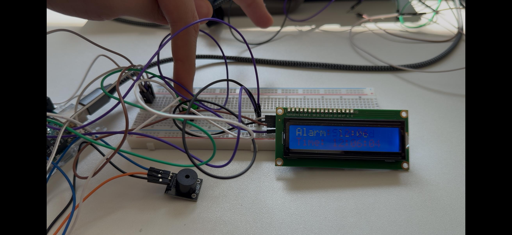
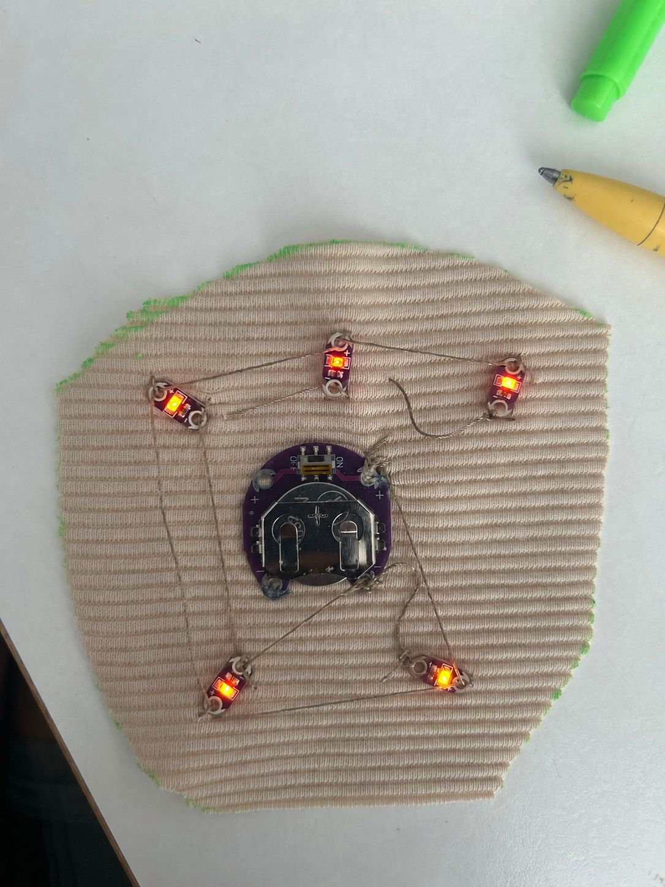
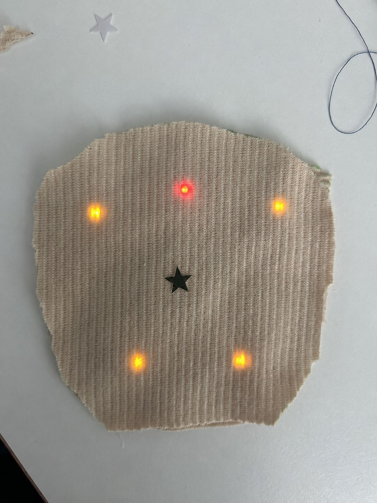
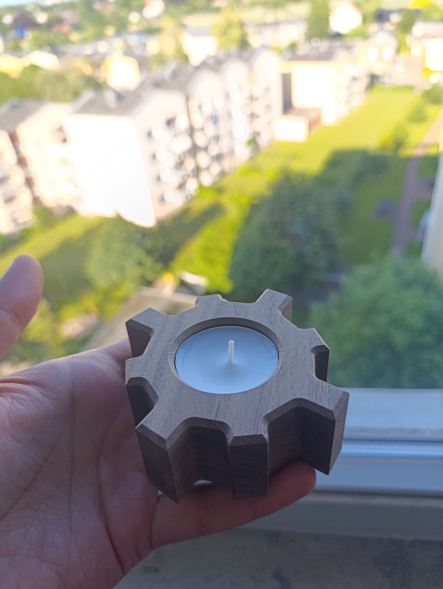
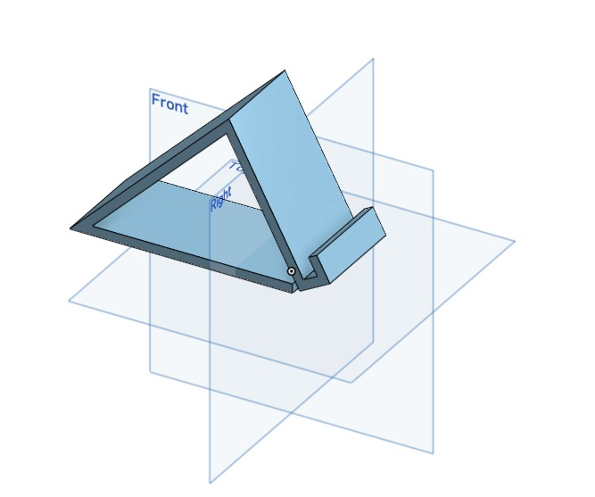
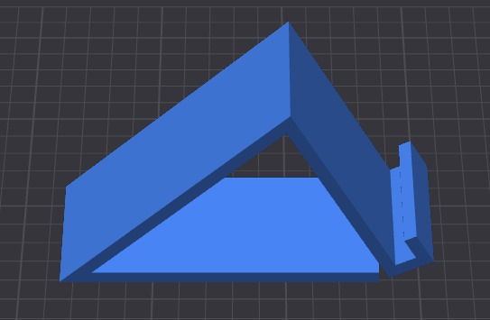
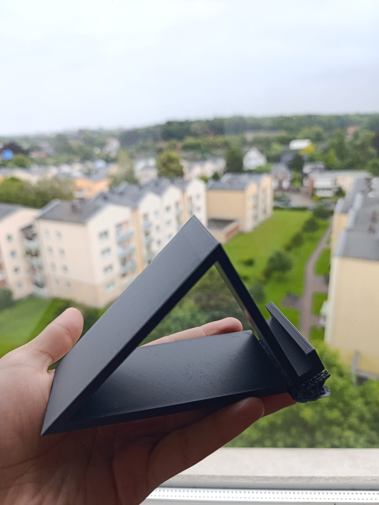

# Exercise 1: Electrical Circuits

**Digital Design & Fabrication**  
Carl von Ossietzky Universität Oldenburg · May 2026

---

## Task 1.1 – Simple LED Circuit

A green LED was connected in series with a current-limiting resistor between a 5 V supply and ground. The circuit was tested with three resistor values: 220 Ω, 1 kΩ, and 4.7 kΩ. Voltage across the resistor (V1) and across the LED (V_LED) were measured for each.

  

<em>Fig 1: Simple LED circuit with 220 Ω resistor, Vcc = 5 V</em>

| R1 | V1 | V_LED |
|----|----|-------|
| 220 Ω | 2.10 V | 2.76 V |
| 1000 Ω | 2.53 V | 2.45 V |
| 4700 Ω | 2.71 V | 2.29 V |

**Observations:** As R1 increases, the voltage drop across the resistor (V1) increases while V_LED decreases. The sum V1 + V_LED ≈ 5 V at all times, confirming Kirchhoff's Voltage Law. The LED forward voltage remains relatively stable (~2.3–2.8 V) regardless of resistor value, while the current decreases significantly with higher resistance — causing the LED to dim. Changing R1 does affect the LED brightness: at 220 Ω it glows brightly, at 4.7 kΩ it is very dim but still on.

**What went wrong:** During initial setup the LED did not light up. After inspection it was found that the LED had been inserted in the wrong orientation — reversed polarity. Flipping the LED in the breadboard resolved the issue immediately. This highlighted the importance of checking component polarity before applying power.

---

## Task 1.2 – Switchable LED Circuit

A toggle switch (S1) was added in series with the circuit. The switch was tested in both orientations.

  

<em>Fig 2: Switchable LED circuit with toggle switch S1</em>

**Observations:** When the switch is open, the circuit is broken and no current flows — the LED is off. When closed, the LED lights at full brightness. Reversing the switch orientation produced identical behaviour, confirming that a mechanical SPST switch is non-polarised. The switch works correctly regardless of which terminal faces the supply or ground.

---

## Task 1.3 – Dimmable LED Circuit

A 1 kΩ potentiometer (R2) was added in series, with its wiper as the variable output. R1 was set to 100 Ω. Voltages were measured at three potentiometer positions.

  

<em>Fig 3a: Dimmable LED circuit with potentiometer</em>

  

<em>Fig 3b: Lab notebook measurements</em>

https://github.com/user-attachments/assets/a8bee591-fca0-44c0-987e-4fc35da2f613

<em>Video 1: Demonstration of the dimmable LED circuit with potentiometer.</em>

| Position | V_LED | V2 |
|----------|-------|----|
| Full brightness | 2.97 V | 2.99 V |
| Dimmed | 2.88 V | 4.55 V |
| OFF | 0.37 V | 4.58 V |

**Observations:** The potentiometer acts as a variable voltage divider. As its resistance increases, V2 rises and V_LED falls. When V_LED drops below the LED forward voltage threshold (~2 V), the LED turns off completely. The relationship is inverse and continuous — rotating the wiper provides smooth, analogue brightness control. V2 + V_LED ≈ 5 V at all positions, confirming KVL.

**What went wrong:** With R1 = 100 Ω the potentiometer regulation range was very narrow — the LED transitioned from full brightness to off with only a very small rotation of the wiper, making smooth dimming difficult to achieve. As suggested in the manual, R1 was replaced with 220 Ω which provided a noticeably wider and smoother dimming range across the full rotation of the potentiometer.

---

## Task 2.1 – Switchable LED Strip

An N-channel MOSFET (IRLZ44N) was used to switch a 12 V LED strip. The control side runs on 5 V from a USB module; the load side on 12 V. A 10 kΩ pull-down resistor holds the gate low when the switch is open, and a 100 Ω gate resistor limits transient current. Both sides share a common ground.

  

<em>Fig 4a: MOSFET switchable LED strip circuit</em>

  

<em>Fig 4b: Full breadboard layout with XIAO MCU</em>

**Observations:** When S1 is open, the pull-down resistor holds V_GS at 0 V — the MOSFET is off and the strip is dark. When S1 is closed, 5 V is applied to the gate, raising V_GS above the threshold (~2 V). The MOSFET conducts and the strip lights fully. The switch controls V_GS, not the load voltage directly. This demonstrates the key advantage of a transistor switch: a small 5 V gate signal controls a high-current 12 V load without direct electrical connection between the two voltage domains.

---

## Task 2.2 – Dimmable LED Strip (PWM)

The switch was replaced with a PWM signal generator powered from the USB module. Two parameters were investigated: duty cycle and switching frequency.

### Part A — Duty Cycle (f = 90 Hz)

  

<em>Fig 5a: D = 2% — barely visible</em>

  

<em>Fig 5b: D = 15% — dim</em>

  

<em>Fig 5c: D = 40% — medium brightness</em>

  

<em>Fig 5d: D = 60% — bright</em>

  

<em>Fig 5e: D = 100% — full brightness</em>

| Duty Cycle | V_LSD |
|-----------|-------|
| 2% | 0.03 V |
| 15% | 2.28 V |
| 40% | 2.77 V |
| 60% | 2.90 V |
| 100% | 2.99 V |

**Observations:** Brightness increases proportionally with duty cycle. At 2% the strip is barely visible; at 100% it reaches full brightness. The MOSFET switches on and off rapidly — the human eye integrates the pulses into a steady perceived intensity equal to the duty cycle percentage of full brightness. Compared to the potentiometer in Task 1.3, PWM is more energy efficient as no power is wasted as heat in a resistor.

### Part B — Switching Frequency (D = 50%)

https://github.com/user-attachments/assets/e2ec74df-cd70-4559-a760-28ac156d2e80

<em>Video 2: Demonstration of PWM duty cycle control on LED strip.</em>

| Frequency | Observation |
|-----------|-------------|
| 5 Hz | Clearly visible slow flashing — eye resolves individual pulses |
| 25 Hz | Fast flicker, still clearly uncomfortable |
| 45 Hz | Barely perceptible — near flicker fusion threshold |
| 100 Hz | No flicker — smooth steady glow at 50% brightness |

**Observations:** At low frequencies the eye resolves individual on/off pulses as visible flicker. As frequency increases past approximately 45–50 Hz — the human visual flicker fusion threshold — the brain can no longer distinguish individual pulses and perceives a continuous steady light. At 100 Hz the strip appears completely smooth. Frequency does not affect brightness — only duty cycle does.

**What went wrong:** At 2% duty cycle the strip looked completely off at first. We double checked all connections but everything was fine — the strip was just so dim it was almost invisible in normal room lighting. Also at 5 Hz the flicker was much stronger than expected and was quite uncomfortable to look at directly.

---

---

# Exercise 2: Introduction to Arduino

**Digital Design & Fabrication**  
Carl von Ossietzky Universität Oldenburg · May 2026

---

## Overview

In this exercise a functional alarm clock was built using the Arduino Uno. Four components were tested individually — a buzzer, an LCD screen, a real-time clock module, and push buttons — before combining them into the final working alarm clock.

---

## Sub-circuit 1 – Connecting the Buzzer

The buzzer was connected to digital pin 12 through a 220 Ω resistor. The `buzzer_test.ino` sketch was used to test it by toggling the pin HIGH and LOW with different delay values.

  

<em>Fig 6: Buzzer connected to Arduino Uno on breadboard</em>

https://github.com/user-attachments/assets/9a6e0dba-1531-4783-a1a0-b57ab22247ac

<em>Video 3: Buzzer test — different tones produced by changing delay values</em>

**Observations:** The buzzer beeped when the code was uploaded. Changing the delay values changed the speed and pitch of the sound — shorter delays made a higher faster tone, longer delays made a slower deeper beep.

---

## Sub-circuit 2 – Connecting the LCD Screen

The LCD communicates over I2C using 4 wires. The I2C scanner returned address `0x27`. The `LCD_test.ino` sketch was then used to print text on the screen.

  

<em>Fig 7: LCD displaying "Hello! LCD Working"</em>

https://github.com/user-attachments/assets/18d1db24-597a-40fb-8042-73b2eb9d5078

<em>Video 4: LCD screen test demonstration</em>

**Observations:** The LCD displayed "Hello! LCD Working" correctly on two lines once the right I2C address was set in the code.

**What went wrong:** The screen showed nothing at first because we had the wrong I2C address (`0x20`) in the code. Running the I2C scanner showed the correct address was `0x27` — updating it fixed the display immediately.

---

## Sub-circuit 3 – Real Time Clock (RTC)

The RTC module was connected to the same I2C bus as the LCD. The scanner now detected two addresses — `0x27` for the LCD and `0x68` for the RTC. The `RTC_LCD_test.ino` sketch displayed the live time on the LCD.

  

<em>Fig 8: RTC + LCD showing live time: 12:05:25</em>

**Observations:** The time displayed correctly on the LCD and updated every second. The RTC has a coin cell battery so it kept the time even after the Arduino was powered off and back on again.

---

## Sub-circuit 4 – Push Button

Push buttons were connected using the Arduino's built-in pull-up resistors with `pinMode(pin, INPUT_PULLUP)`. The `Button.h` library was used to handle debouncing.

  

<em>Fig 9: Alarm clock showing alarm time set to 12:00 and current time 12:06:04</em>

**Observations:** The buttons worked reliably with the pull-up resistor setup. Without the library the button registered multiple presses for a single press — the `Button.h` library fixed this automatically.

---

## Final Task – Alarm Clock

All components were combined into a working alarm clock. The LCD shows the current time, buttons set the alarm, the buzzer triggers when the alarm time is reached, and another button turns it off.

  

<em>Fig 10: Final alarm clock — LCD showing "Time: 12:44:56" and "Alarm is ON"</em>

https://github.com/user-attachments/assets/3cdfd8dd-a4b9-4844-b665-b89b80fd38cf

<em>Video 5: Alarm clock in operation — alarm triggering at set time</em>

https://github.com/user-attachments/assets/58a5d6a6-7fd8-4745-bccc-1719932bdc61

<em>Video 6: Alarm dismissal — turning off the alarm using push button</em>

**Observations:** The alarm clock worked as intended. The time was accurate, the alarm triggered at the correct time, and the buzzer could be dismissed with a button press without touching the code.

---

## Components Used

- Arduino Uno
- 16x2 I2C LCD — address `0x27`
- DS1307 RTC Module — address `0x68`
- Passive buzzer + 220 Ω resistor
- Push buttons x4
- Breadboard + jumper wires
- Libraries: `LiquidCrystal_I2C.h`, `RTClib.h`, `Button.h`

---

---

# Exercise 3: Sensors & Actuators

**Digital Design & Fabrication**  
Carl von Ossietzky Universität Oldenburg · May 2026

---

## Overview

In this exercise, we put together a small pneumatic setup made of two air pumps, a directional valve, and an inflatable pillow. The system was controlled using an Arduino Uno together with three IRF520 MOSFET driver modules, with each actuator handled separately.

The task was basically in two steps: first getting the basic electrical and pneumatic setup to work, and then adding a simple sensor-based interaction to control inflation and deflation automatically.

---

## Part A — Pneumatic & Electrical Circuit

For the electronics, we used three IRF520 MOSFET modules to switch two pumps and one air valve. Each module was connected to a separate Arduino digital pin, while the pumps and valve were powered from an external lab supply because the current demand was too high for the Arduino.

We started with a simple test sketch to activate each actuator one by one and check if everything was responding correctly. The small LEDs on the MOSFET boards were actually helpful here since they clearly showed when each part was active.

After that, we assembled the pneumatic part using silicone tubing. Both pumps and the valve were connected to the inflatable pillow. The FA0520E valve has three ports: a central common port, one port that stays open when the valve is not powered, and another that opens when power is applied. This allowed us to control the airflow between inflation and deflation.

https://github.com/user-attachments/assets/0a7ab42b-bb2b-4fa0-86e0-5ba6e94dbbc4

<em>Video 7: Pneumatic circuit test — pillow inflating and deflating</em>

**Observations:** The inflation part worked without issues and the pillow filled up as expected. All MOSFET modules responded correctly to the Arduino signals, and the LEDs made it easy to see which part was switching at any moment.

**What went wrong:** At first, everything seemed fine for inflation, but deflation was not working properly. After checking the setup step by step, we found that the valve tubing was connected to the wrong ports. Once this was fixed, both inflation and deflation worked normally.

---

## Part B — Sensor Interaction

For the second part, we used an ultrasonic distance sensor to build a simple gesture-based control setup. The idea was to imitate a pumping motion: when the hand moves closer to the sensor, the system starts inflating, and when the hand moves away, it switches to deflation.

The sensor was connected to the Arduino, and we used the NewPing library to read the distance values. In the code, we set a threshold distance so that the system reacts when the hand gets close enough. Below that point, the inflation pump turns on, and when the hand moves back, it changes to deflation.

https://github.com/user-attachments/assets/0e2c1508-46c0-4f7f-ac64-66a07c5c95a7

<em>Video 8: Sensor interaction — hand gesture controlling inflation</em>

https://github.com/user-attachments/assets/47d95dc2-21e7-4a35-a051-9deea6457f63

<em>Video 9: Full system demonstration — sensor-driven inflate and deflate cycle</em>

**Observations:** The ultrasonic sensor worked quite consistently and responded well to hand movements. The interaction felt pretty intuitive in practice, almost like manually pumping air. The pumps and MOSFET modules didn’t cause any issues, and the valve also switched correctly between the two airflow paths.

---

## Components Used

- Arduino Uno
- 2x Air Pump ZR370-02PM (4.5V, ~500mA each)
- 1x Air Valve FA0520E (6V, ~400mA)
- 3x IRF520 MOSFET Driver Modules
- Ultrasonic Distance Sensor
- Inflatable pillow + silicone tubing
- Lab power supply (load side)
- USB power (Arduino + sensor)
- Library: `NewPing.h`

---

---

# Exercise 4: E-Textiles — LED Patch

**Physical Computing (inf175)**  
Carl von Ossietzky Universität Oldenburg · June 2026

---

## Overview

In this exercise an e-textile LED patch was designed and hand-sewn onto fabric. The goal was to create a wearable patch that can be attached to clothing, gain experience with soft circuits and conductive thread, and learn to handle unexpected setbacks during the making process.

---

## Design & Planning

A paper template was created first to plan the layout of the patch, the position of the LEDs, and the routing of the conductive thread traces. A parallel circuit was chosen over a series circuit — conductive thread has relatively high resistance, and a series circuit would have caused uneven brightness or some LEDs not lighting up at all. In a parallel circuit the voltage remains constant across all LEDs, ensuring all five light up at the same brightness.

The patch was cut from a ribbed fabric textile into a rounded shield shape. The circuit layout was sketched with a fabric pen before sewing began.

---

## Assembly

The sewable 3V coin battery holder was placed at the centre of the base fabric and stitched down with conductive thread. Five sewable LEDs were positioned around it — two on the upper left and right, one at the top centre, and two at the lower left and right. Each LED was connected in parallel using conductive thread sewn with a back stitch, connecting the positive pads to the positive terminal of the battery and the negative pads to the negative terminal.

Care was taken to keep the positive and negative thread traces completely separate to avoid short circuits. The thread was knotted securely at each connection point.

  

<em>Fig 11: Back of the e-textile patch showing sewable LEDs, conductive thread traces and coin battery holder</em>

  

<em>Fig 12: Front of the patch with all 5 LEDs glowing through the fabric</em>

https://github.com/user-attachments/assets/b6fee284-a17e-4c3b-b6bc-1ee5687465d8

<em>Video 10: E-textile patch in operation — all LEDs lit</em>

---

## Observations

All five LEDs lit up when the battery switch was turned on. The parallel circuit worked as expected — each LED received the same voltage and glowed at consistent brightness. The fabric diffused the light nicely from the front, giving a soft warm glow through the textile. The coin battery holder with its built-in on/off switch made it easy to power the circuit on and off without disconnecting anything.

---

**What went wrong:** Threading the conductive thread through the needle was more difficult than regular thread — a needle threader was used as recommended. Keeping the thread traces from crossing each other while maintaining a tidy stitch pattern required careful planning. At one point during sewing a loose knot caused one LED to flicker — re-tightening the connection at that pad fixed it.

---

## Components Used

- Sewable 3V coin battery holder (with on/off switch)
- 5x sewable LEDs
- Conductive thread
- Ribbed fabric (base textile)
- Sewing needle + needle threader
- Fabric pen
- Scissors
---

---

# Exercise 5: CNC Machining — Gear Tealight Holder

**Makers Lab (inf174)**  
Carl von Ossietzky Universität Oldenburg · June 2026

---

## Overview

In this exercise a tealight holder was designed and produced on a 3-axis CNC milling machine. CNC machining is a *subtractive* process — material is removed from a solid block (the stock) until only the desired geometry remains. The goal was to take a part through the full **CAD → CAM → CNC** workflow and machine it out of solid hardwood. A gear/cog shape was chosen for the holder, with a circular pocket sized to seat a standard tealight candle.

---

## Design & Planning

The part was designed in Inkscape as a 2D vector drawing and exported as an SVG. The outline is a single continuous closed path forming an eight-toothed gear roughly 84 mm across, with a central circle of Ø39.5 mm defining the candle pocket. A standard tealight is about 38 mm in diameter, so the 39.5 mm pocket leaves a small clearance for the candle to drop in and out easily.

Two machining constraints from the lecture were kept in mind. First, on a 3-axis mill the tool only approaches from above and internal corners are always rounded to the tool radius, so the gear roots were drawn with rounded fillets rather than sharp inside corners. Second, the outline was kept as one closed path with no fill so the CAM software would read it cleanly as a single contour.

  

<em>Fig 13: Gear outline and central candle pocket designed as a 2D vector in Inkscape</em>

---

## CAM — Toolpath Preparation

The SVG was imported into the CAM software to generate the toolpaths and G-code. Two operations were defined:

- a **pocket** operation for the central Ø39.5 mm circle, cut to a partial depth so the tealight sits *inside* the holder rather than passing through
- a **profile / contour** operation around the gear outline, cut to full stock depth to release the finished part

A flat end mill was used for both the pocketing and the profile cut. Holding tabs were left on the outer profile so the part would not break free and shift once it was cut through. The toolpaths were simulated before export to check for collisions and to confirm the tool could reach every feature.

---

## Machine Operation

The hardwood stock (walnut) was secured to the machine bed, the end mill was loaded, and the machine zero (X, Y, Z reference) was set against the corner of the stock. The central pocket was machined first, followed by the outer gear profile. The cut was monitored throughout. After machining, the holding tabs were cut away and the edges were lightly sanded to remove burrs and tool marks.

  

<em>Fig 14: Finished walnut gear tealight holder with a standard tealight seated in the pocket</em>

---

## Observations

The CAD → CAM → CNC workflow produced a clean part that matched the design. The walnut machined well and the grain gave the finished holder a warm, dark appearance. The Ø39.5 mm pocket seated a standard tealight with just enough clearance for an easy fit. The gear roots came out with small rounded fillets — a direct consequence of the round tool only being able to approach the material from above, exactly as expected for a 3-axis mill.

---

## Components Used

- 3-axis CNC milling machine
- Flat end mill
- Walnut hardwood stock
- Inkscape (2D CAD design, SVG output)
- CAM software (toolpath generation → G-code)
- Standard tealight candle (~38 mm)

---

---

# Exercise 6: Laser Cutting — Business Card

**Digital Design & Fabrication**  
Carl von Ossietzky Universität Oldenburg · June 2026

---

## Overview

In this exercise a personalised business card was designed in Inkscape and produced using the Epilog laser cutter. The exercise covered artwork preparation, setting up the laser cutter dashboard with the correct job settings, and operating the machine to engrave and cut the final card.

---

## Design & Preparation

The business card was designed in Inkscape with the name, title, and university affiliation laid out on the front, and the Carl von Ossietzky Universität Oldenburg branding on the back. The document was set up at A4 size in RGB colour mode, with all vector cutting lines set to a stroke width of 0.025 mm to ensure they would be recognised correctly by the laser cutter as cut lines rather than raster engraving.

The artwork was positioned in the top-left corner of the page to align with the laser cutter's home position, minimising wasted material.

---

## Laser Cutter Setup

The job was sent to the Epilog Engraver via File → Print, with the Epilog Dashboard opened through the printer properties. In the General tab, the job type was set to Vector for cutting the card outline, with the material thickness entered in millimetres. CO2 was selected as the laser source, with Auto Focus and Vector Grid enabled.

Speed, power, and frequency values for the vector cut were set based on the material being used, with Power Comp. enabled and Speed Comp. left off as recommended.

---

## Machine Operation

Before starting the job, the fume extractor and compressor were switched on, as required for safe operation. The material was placed in the top-left corner of the cutting bed against the metal rulers. The Red Dot Pointer was used to set the home position for the job.

The job was selected from the Job menu and started by pressing the Go button. The cutting process was monitored throughout to watch for flame-ups or any irregularities, as recommended in the safety guidelines.

https://github.com/user-attachments/assets/3cfde8df-1d1d-4363-b6f6-1ac80d1e0073

<em>Video 11: Setting up the laser cutter job and home position</em>

https://github.com/user-attachments/assets/8ce55ab7-97ed-427f-9b59-5e109b0d84f9

<em>Video 12: Laser cutter engraving and cutting the business card</em>

https://github.com/user-attachments/assets/c83cf8f3-4781-4492-adf9-5cee4643edea

<em>Video 13: Close-up of the finished business card</em>

---

## Observations

The vector cutting settings worked well for the chosen material, producing clean cut edges with minimal charring. The Epilog Dashboard's General tab settings (CO2 source, Auto Focus, Vector Grid) were sufficient for a straightforward single-material job without needing Color Mapping. Positioning the artwork in the top-left corner and setting the home position correctly ensured the cut aligned precisely with the intended design. The fume extractor effectively handled the smoke produced during cutting, and the overall process was smooth from design to finished card.

---

## Components Used

- Inkscape (artwork design)
- Epilog laser cutter
- Epilog Dashboard (Fusion software)
- Material as per material settings table (Vector mode)
- Fume extractor + compressor (Air Assist)
---

---

# Exercise 7: Introduction to Parametric Feature-Based CAD (Onshape Self-Study)

**Digital Design & Fabrication (inf175)**
Carl von Ossietzky Universität Oldenburg · June 2026

---

## Overview

In place of the in-person session on 18/06/2026, the *Introduction to CAD* learning path was completed self-paced on Onshape — a free, cloud-based parametric CAD system. An account was created using the university email address. The learning path consists of three required courses — *Introduction to Parametric Feature-Based CAD*, *Introduction to Sketching*, and *Introduction to Part Studios* — which were worked through in order and all completed.

  

<em>Fig 15: Onshape learning path showing all three required courses marked "Completed!"</em>

  

<em>Fig 16: My Training Dashboard — Completed: 3, confirming all three courses finished</em>

---

## Course 1 – Introduction to Parametric Feature-Based CAD

The first course introduced the principles behind parametric, feature-based modelling. In a parametric system the geometry is driven by named dimensions and parameters, so changing a value such as a length or a radius updates the model automatically instead of requiring it to be redrawn. A part is built up from an ordered stack of features — sketch, extrude, fillet and so on — recorded in a feature tree that can be edited, reordered or rolled back at any point. The course also covered the idea of design intent: deliberately building a model so that later edits propagate the way the designer expects, using constraints and relationships rather than fixed coordinates.

**Observations:** The feature history is the central idea of this kind of CAD. It makes the model easy to edit after the fact, but it also creates dependencies — early features that later features rely on cannot be deleted or renamed without breaking the geometry that follows them.

---

## Course 2 – Introduction to Sketching

The second course covered 2D sketching, which is the foundation every 3D feature is built on. A sketch is drawn on a plane or on an existing face and is made up of entities such as lines, arcs, circles and rectangles. These entities are then locked down with geometric constraints (coincident, parallel, perpendicular, tangent, equal, concentric, symmetric) and with dimensions. Onshape colour-codes the sketch state — an under-defined sketch is shown in blue and can still move, while a fully-defined sketch is shown in black with every degree of freedom locked. Fully defining a sketch before moving on is best practice.

**Observations:** Constraints capture relationships between entities while dimensions capture exact values. Getting a sketch to be exactly defined — not under-constrained and not over-constrained — is the key to a model that behaves predictably when a dimension is changed later.

---

## Course 3 – Introduction to Part Studios

The third and longest course covered the Part Studio, the environment where sketches are turned into solid geometry. Solid-creating features such as Extrude, Revolve, Sweep and Loft build 3D shapes from 2D sketches, while modifying features such as Fillet, Chamfer, Shell and the boolean operations refine the existing geometry. A single Part Studio can hold more than one part, modelled together in the same context so that parts can reference each other's geometry and stay in sync. Features are added in sequence in the feature toolbar, and the rollback bar allows new features to be inserted earlier in the history.

**Observations:** Onshape's approach of modelling multiple parts in one Part Studio is different from older CAD tools where one file holds one part. Designing parts in relation to each other means that when one part's dimensions change, the parts that reference it update with it, reducing manual rework.

---

## Components Used

- Onshape (free cloud-based parametric CAD system)
- University email account
- Web browser
- Learning path: Introduction to CAD
  - Introduction to Parametric Feature-Based CAD
  - Introduction to Sketching
  - Introduction to Part Studios
---

---

# Exercise 8: 3D Printing — Phone/Tablet Stand

**Digital Design & Fabrication (inf175)**
Carl von Ossietzky Universität Oldenburg · July 2026

---

## Overview

For this exercise a phone/tablet stand was designed in CAD and printed on the lab's FDM printers. The goal was to run through the full workflow from the lecture — CAD, slicer, print — and actually think about orientation and supports instead of just printing the first design that came to mind.

---

## Design

The stand is a simple triangular gusset: two angled side walls meeting at the top, a flat base, and a small slotted tab at the back to hold the phone or tablet at an angle. The sketch was built on the front, top and right planes and fully constrained before extruding, with the slot cut afterwards as a separate feature.

  

<em>Fig 17: CAD model of the stand, front/top/right planes visible</em>

The shape was kept deliberately simple — flat panels, one slot — so it could be printed without supports if oriented sensibly, based on what we covered in the lecture about overhang angles and the slicer's support threshold.

---

## Slicing

The STL was laid on its side in the slicer, using the triangular face as the base rather than standing the part up on its thin edge. This kept the long sloped face at a shallow enough angle to stay under the default support threshold, so the main body didn't need any support material. The small tab at the back had a minor overhang, and the slicer added just a few lines of support underneath it.

  

<em>Fig 18: Sliced preview showing the stand lying on its triangular face</em>

Settings: 0.2 mm layer height, 15% infill, PLA. Since the part is mostly wide flat panels rather than a tall structure, orientation here mattered more for avoiding supports than for print strength — the panels mainly load in bending, not along the layer lines.

---

## Print & Result

  

<em>Fig 19: Finished PLA print (black), photographed after removing from the bed</em>

The print came out clean — sharp corners, solid layer adhesion, no warping or lifting at the base. The triangular shape gave it a large flat contact area on the bed, so adhesion wasn't a concern at all, unlike some of the taller/narrower prints from the lecture that need a brim. The final part matches the CAD model closely and holds a phone at a stable angle as intended.

---

## Components Used

- CAD software (Onshape)
- FDM 3D printer (lab machine, QIDI-type slicer workflow)
- PLA filament, 0.4 mm nozzle
- Slicer settings: 0.2 mm layer height, 15% infill, no supports on main body
