# Exercise 1: Electrical Circuits

**Digital Design & Fabrication**  
Carl von Ossietzky Universität Oldenburg · May 2026

---

## Task 1.1 – Simple LED Circuit

A green LED was connected in series with a current-limiting resistor between a 5 V supply and ground. The circuit was tested with three resistor values: 220 Ω, 1 kΩ, and 4.7 kΩ. Voltage across the resistor (V1) and across the LED (V_LED) were measured for each.

  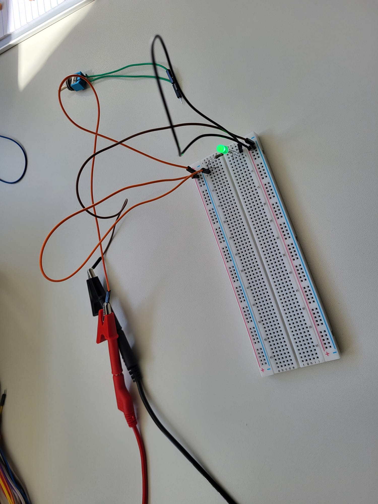

<em>Fig 1: Simple LED circuit with 220 Ω resistor, Vcc = 5 V</em>

| R1 | V1 | V_LED |
|----|----|-------|
| 220 Ω | 2.10 V | 2.76 V |
| 1000 Ω | 2.53 V | 2.45 V |
| 4700 Ω | 2.71 V | 2.29 V |

**Observations:** As R1 increases, the voltage drop across the resistor (V1) increases while V_LED decreases. The sum V1 + V_LED ≈ 5 V at all times, confirming Kirchhoff's Voltage Law. The LED forward voltage remains relatively stable (~2.3–2.8 V) regardless of resistor value, while the current decreases significantly with higher resistance — causing the LED to dim. Changing R1 does affect the LED brightness: at 220 Ω it glows brightly, at 4.7 kΩ it is very dim but still on.

**Encountered Issue:** During initial setup the LED did not light up. After inspection it was found that the LED had been inserted in the wrong orientation — reversed polarity. Flipping the LED in the breadboard resolved the issue immediately. This highlighted the importance of checking component polarity before applying power.

---

## Task 1.2 – Switchable LED Circuit

A toggle switch (S1) was added in series with the circuit. The switch was tested in both orientations.

  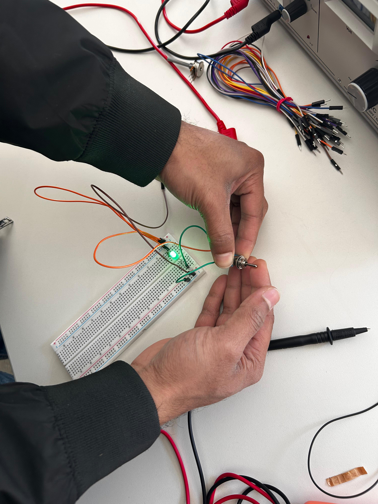

<em>Fig 2: Switchable LED circuit with toggle switch S1</em>

**Observations:** When the switch is open, the circuit is broken and no current flows — the LED is off. When closed, the LED lights at full brightness. Reversing the switch orientation produced identical behaviour, confirming that a mechanical SPST switch is non-polarised. The switch works correctly regardless of which terminal faces the supply or ground.

---

## Task 1.3 – Dimmable LED Circuit

A 1 kΩ potentiometer (R2) was added in series, with its wiper as the variable output. R1 was set to 100 Ω. Voltages were measured at three potentiometer positions.

  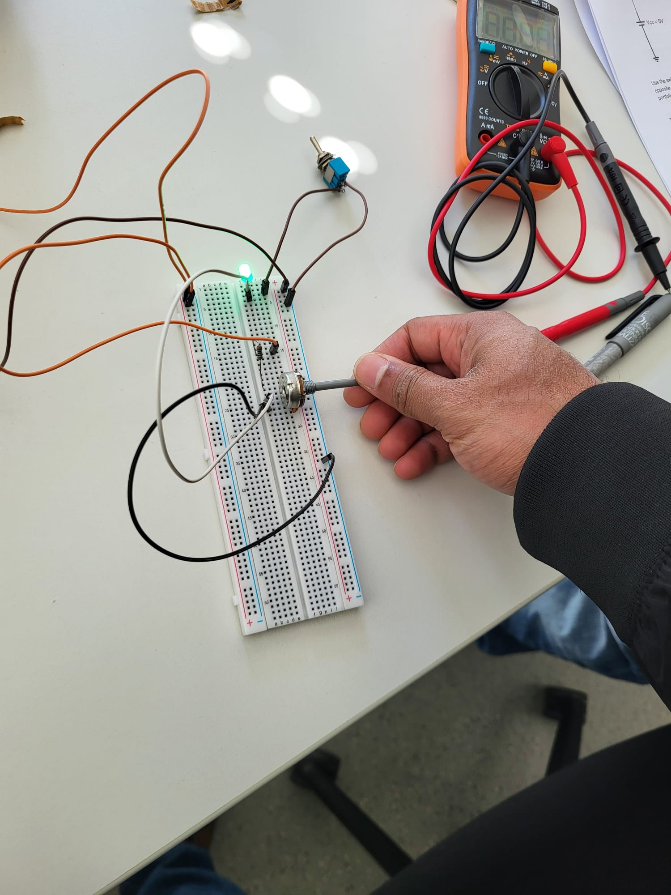

<em>Fig 3a: Dimmable LED circuit with potentiometer</em>

  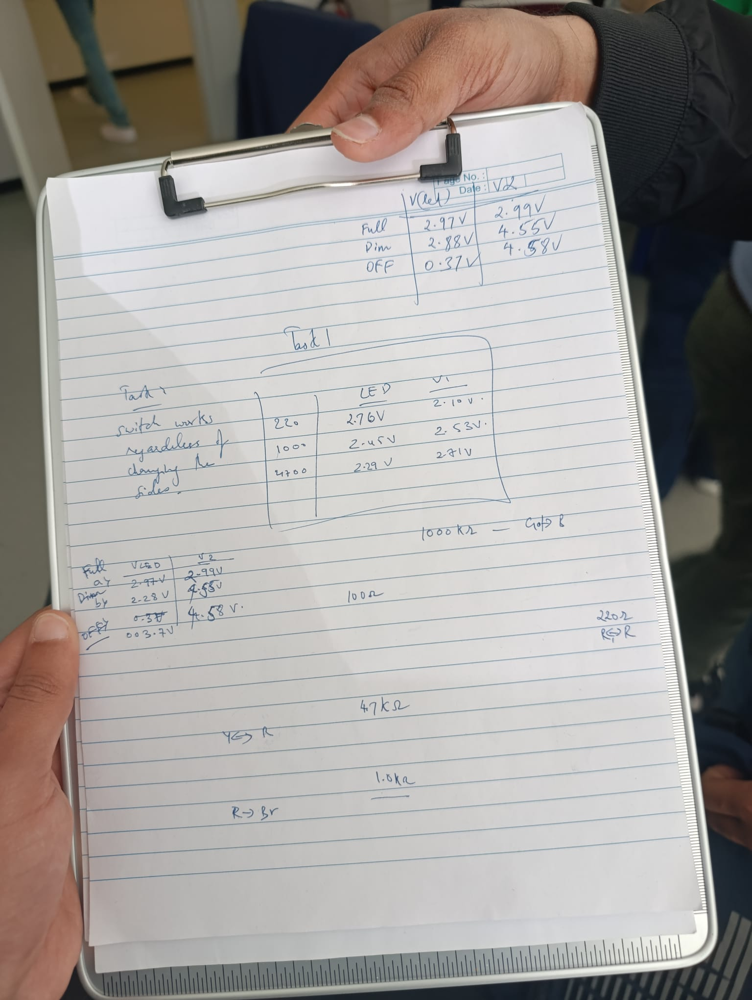

<em>Fig 3b: Lab notebook measurements</em>

https://github.com/user-attachments/assets/a8bee591-fca0-44c0-987e-4fc35da2f613

<em>Video 1: Demonstration of the dimmable LED circuit with potentiometer.</em>

| Position | V_LED | V2 |
|----------|-------|----|
| Full brightness | 2.97 V | 2.99 V |
| Dimmed | 2.88 V | 4.55 V |
| OFF | 0.37 V | 4.58 V |

**Observations:** The potentiometer acts as a variable voltage divider. As its resistance increases, V2 rises and V_LED falls. When V_LED drops below the LED forward voltage threshold (~2 V), the LED turns off completely. The relationship is inverse and continuous — rotating the wiper provides smooth, analogue brightness control. V2 + V_LED ≈ 5 V at all positions, confirming KVL.

**Encountered Issue:** With R1 = 100 Ω the potentiometer regulation range was very narrow — the LED transitioned from full brightness to off with only a very small rotation of the wiper, making smooth dimming difficult to achieve. As suggested in the manual, R1 was replaced with 220 Ω which provided a noticeably wider and smoother dimming range across the full rotation of the potentiometer.

---

## Task 2.1 – Switchable LED Strip

An N-channel MOSFET (IRLZ44N) was used to switch a 12 V LED strip. The control side runs on 5 V from a USB module; the load side on 12 V. A 10 kΩ pull-down resistor holds the gate low when the switch is open, and a 100 Ω gate resistor limits transient current. Both sides share a common ground.

  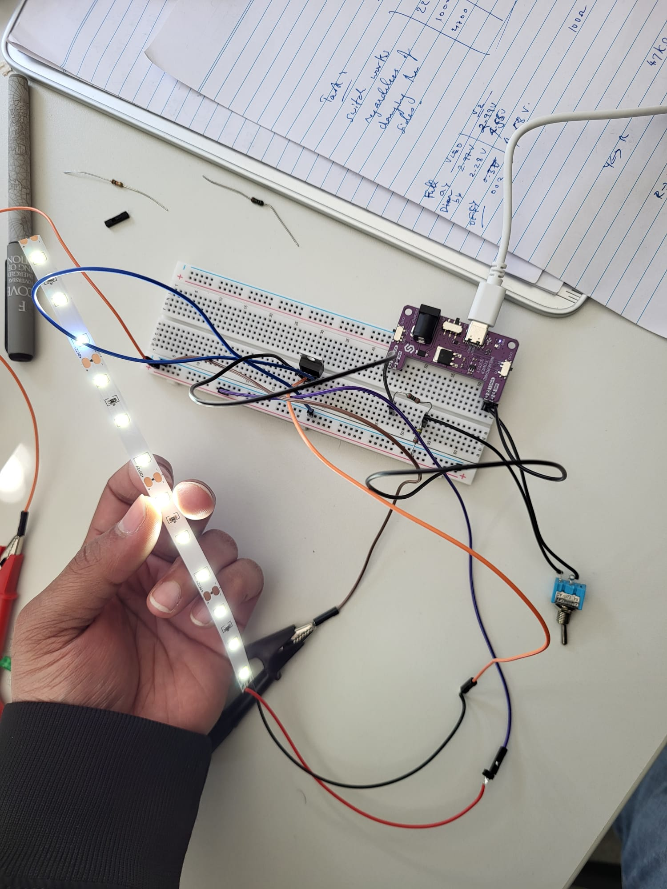

<em>Fig 4a: MOSFET switchable LED strip circuit</em>

  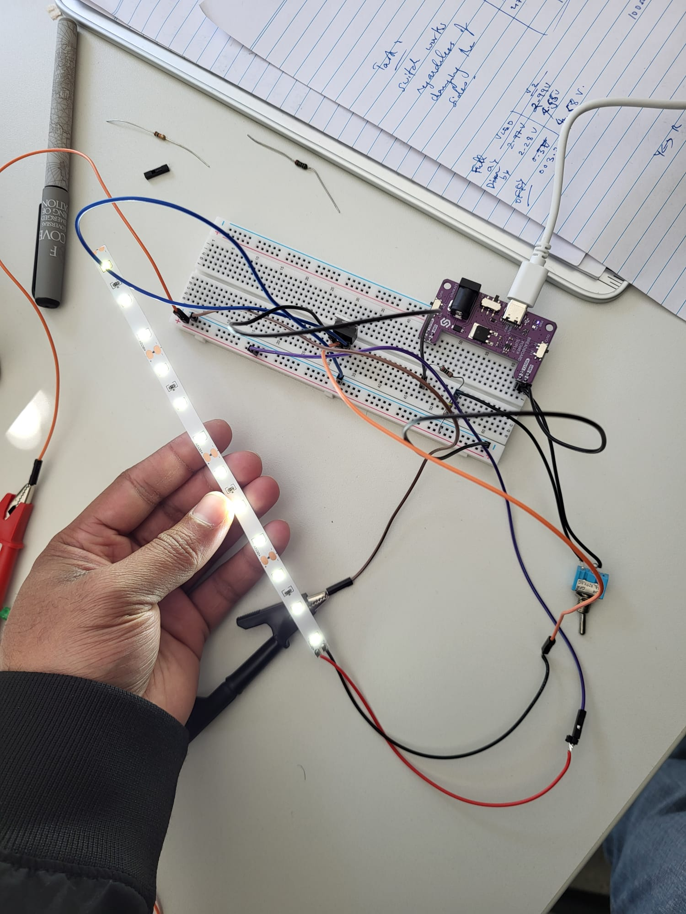

<em>Fig 4b: Full breadboard layout with XIAO MCU</em>

**Observations:** When S1 is open, the pull-down resistor holds V_GS at 0 V — the MOSFET is off and the strip is dark. When S1 is closed, 5 V is applied to the gate, raising V_GS above the threshold (~2 V). The MOSFET conducts and the strip lights fully. The switch controls V_GS, not the load voltage directly. This demonstrates the key advantage of a transistor switch: a small 5 V gate signal controls a high-current 12 V load without direct electrical connection between the two voltage domains.

---

## Task 2.2 – Dimmable LED Strip (PWM)

The switch was replaced with a PWM signal generator powered from the USB module. Two parameters were investigated: duty cycle and switching frequency.

### Part A — Duty Cycle (f = 90 Hz)

  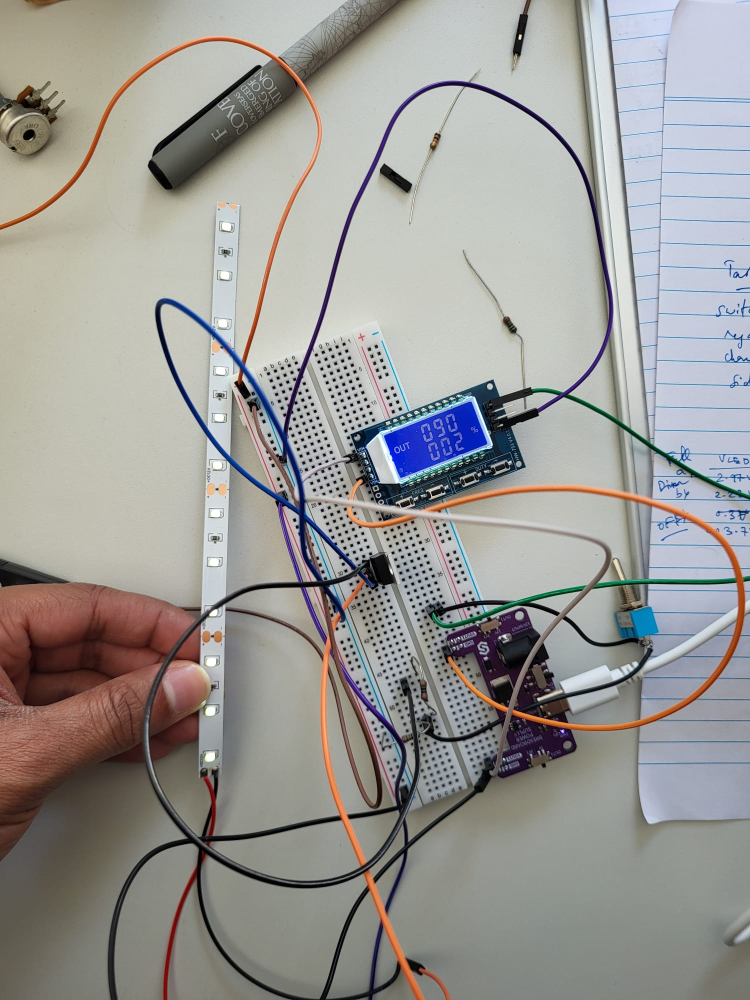

<em>Fig 5a: D = 2% — barely visible</em>

  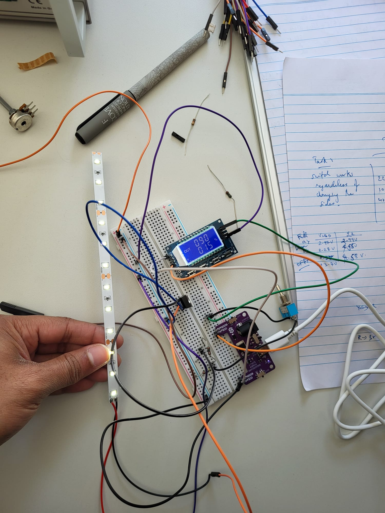

<em>Fig 5b: D = 15% — dim</em>

  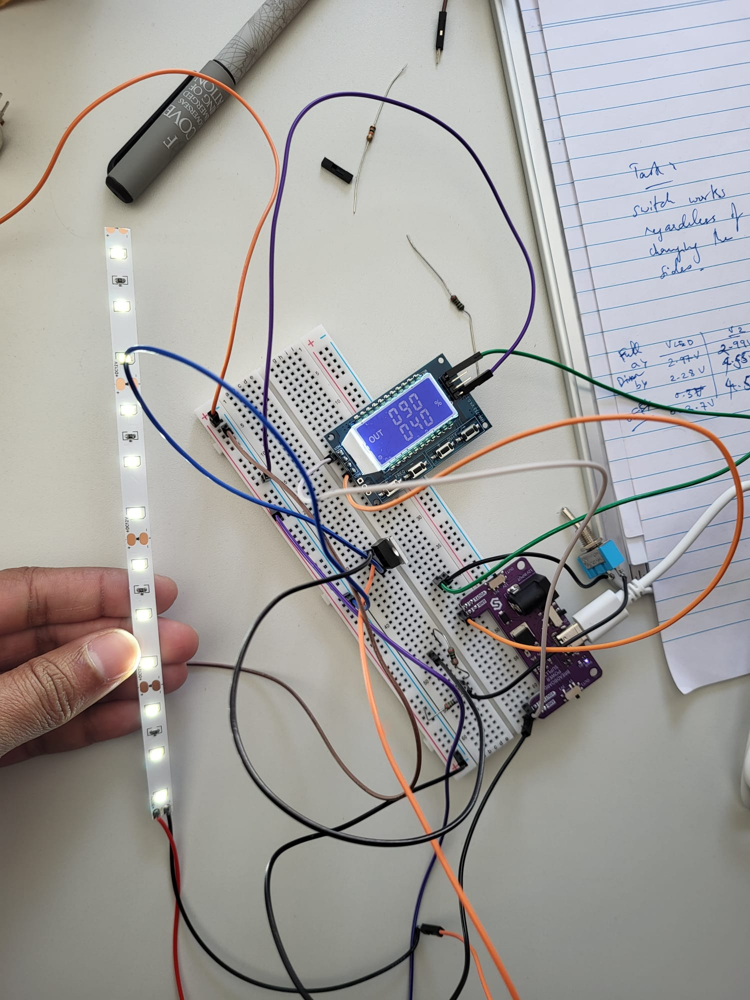

<em>Fig 5c: D = 40% — medium brightness</em>

  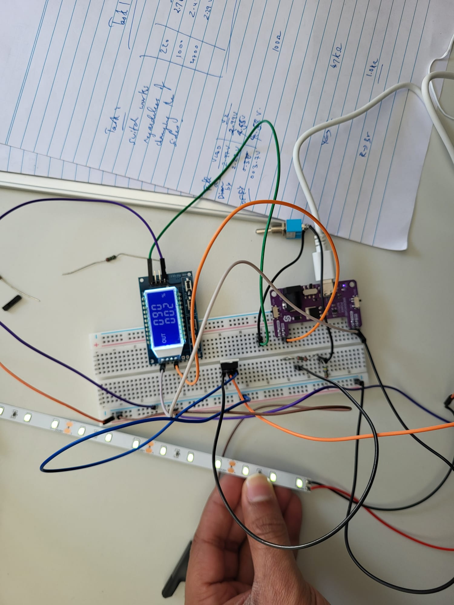

<em>Fig 5d: D = 60% — bright</em>

  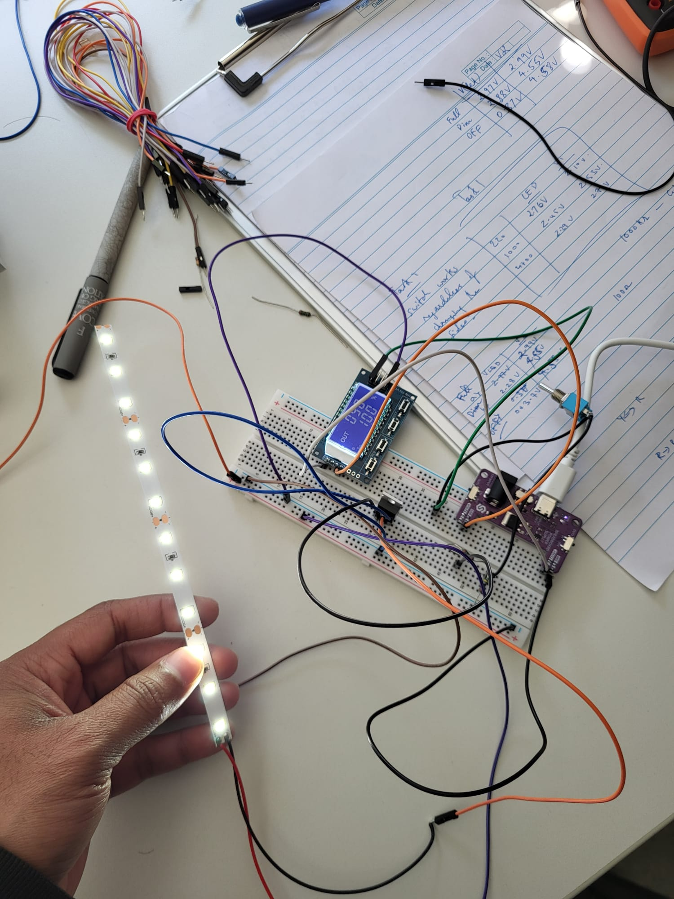

<em>Fig 5e: D = 100% — full brightness</em>

| Duty Cycle | V_LSD |
|-----------|-------|
| 2% | 0.03 V |
| 15% | 2.28 V |
| 40% | 2.77 V |
| 75% | 2.90 V |
| 100% | 2.99 V |

**Observations:** Brightness increases proportionally with duty cycle. At 2% the strip is barely visible; at 100% it reaches full brightness. The MOSFET switches on and off rapidly — the human eye integrates the pulses into a steady perceived intensity equal to the duty cycle percentage of full brightness. Compared to the potentiometer in Task 1.3, PWM is more energy efficient as no power is wasted as heat in a resistor.

### Part B — Switching Frequency (D = 50%)

https://github.com/user-attachments/assets/e2ec74df-cd70-4559-a760-28ac156d2e80

<em>Video 2: Demonstration of PWM duty cycle control on LED strip.</em>

| Frequency | Observation |
|-----------|-------------|
| 5 Hz | Clearly visible slow flashing — eye resolves individual pulses |
| 25 Hz | Fast flicker, still clearly uncomfortable |
| 45 Hz | Barely perceptible — near flicker fusion threshold |
| 100 Hz | No flicker — smooth steady glow at 50% brightness |

**Observations:** At low frequencies the eye resolves individual on/off pulses as visible flicker. As frequency increases past approximately 45–50 Hz — the human visual flicker fusion threshold — the brain can no longer distinguish individual pulses and perceives a continuous steady light. At 100 Hz the strip appears completely smooth. Frequency does not affect brightness — only duty cycle does.

**What went wrong:** At 2% duty cycle the strip looked completely off at first. We double checked all connections but everything was fine — the strip was just so dim it was almost invisible in normal room lighting. Also at 5 Hz the flicker was much stronger than expected and was quite uncomfortable to look at directly.

---

---

# Exercise 2: Introduction to Arduino

**Digital Design & Fabrication**  
Carl von Ossietzky Universität Oldenburg · May 2026

---

## Overview

In this exercise a functional alarm clock was built using the Arduino Uno. Four components were tested individually — a buzzer, an LCD screen, a real-time clock module, and push buttons — before combining them into the final working alarm clock.

---

## Sub-circuit 1 – Connecting the Buzzer

The buzzer was connected to digital pin 12 through a 220 Ω resistor. The `buzzer_test.ino` sketch was used to test it by toggling the pin HIGH and LOW with different delay values.

  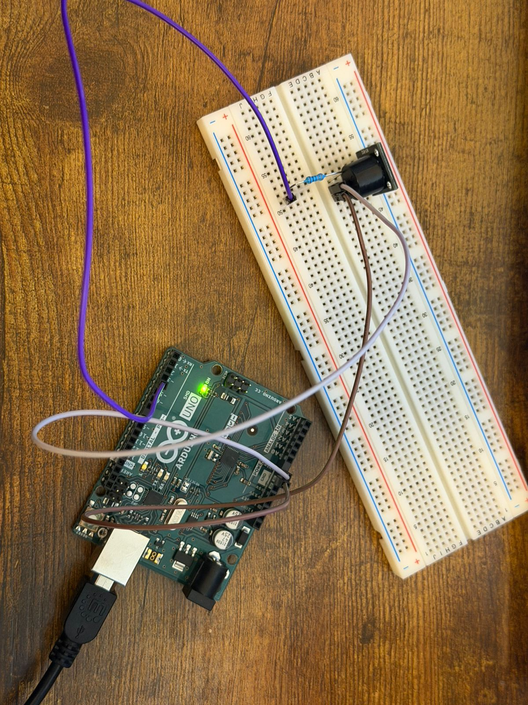

<em>Fig 6: Buzzer connected to Arduino Uno on breadboard</em>

https://github.com/user-attachments/assets/9a6e0dba-1531-4783-a1a0-b57ab22247ac

<em>Video 3: Buzzer test — different tones produced by changing delay values</em>

**Observations:** The buzzer beeped when the code was uploaded. Changing the delay values changed the speed and pitch of the sound — shorter delays made a higher faster tone, longer delays made a slower deeper beep.

---

## Sub-circuit 2 – Connecting the LCD Screen

The LCD communicates over I2C using 4 wires. The I2C scanner returned address `0x27`. The `LCD_test.ino` sketch was then used to print text on the screen.

  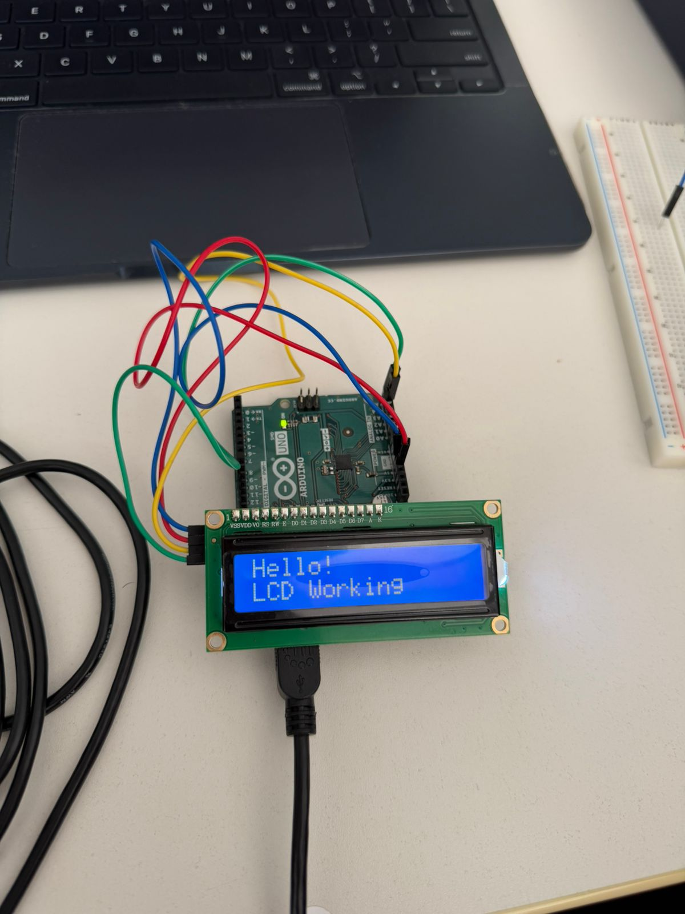

<em>Fig 7: LCD displaying "Hello! LCD Working"</em>

https://github.com/user-attachments/assets/531323ed-8c19-41d9-a475-2009a41c4adf

<em>Video 4: LCD test — message displayed successfully</em>

**Observations:** The LCD displayed "Hello! LCD Working" correctly on two lines once the right I2C address was set in the code.

**What went wrong:** The screen showed nothing at first because we had the wrong I2C address (`0x20`) in the code. Running the I2C scanner showed the correct address was `0x27` — updating it fixed the display immediately.

---

## Sub-circuit 3 – Real Time Clock (RTC)

The RTC module was connected to the same I2C bus as the LCD. The scanner now detected two addresses — `0x27` for the LCD and `0x68` for the RTC. The `RTC_LCD_test.ino` sketch displayed the live time on the LCD.

  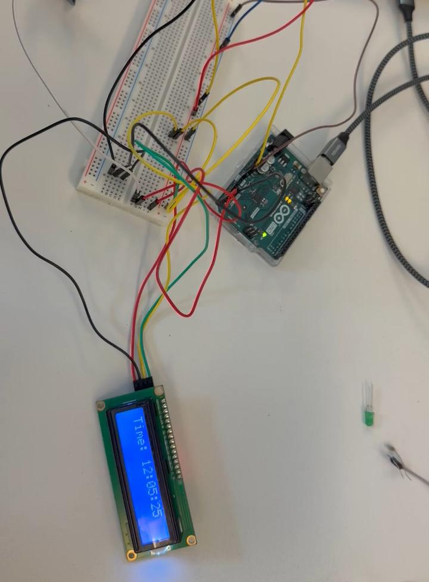

<em>Fig 8: RTC + LCD showing live time: 12:05:25</em>

**Observations:** The time displayed correctly on the LCD and updated every second. The RTC has a coin cell battery so it kept the time even after the Arduino was powered off and back on again.

---

## Sub-circuit 4 – Push Button

Push buttons were connected using the Arduino's built-in pull-up resistors with `pinMode(pin, INPUT_PULLUP)`. The `Button.h` library was used to handle debouncing.

**Observations:** The buttons worked reliably with the pull-up resistor setup. Without the library the button registered multiple presses for a single press — the `Button.h` library fixed this automatically.

---

## Final Task – Alarm Clock

All components were combined into a working alarm clock. The LCD shows the current time, buttons set the alarm, the buzzer triggers when the alarm time is reached, and another button turns it off.

  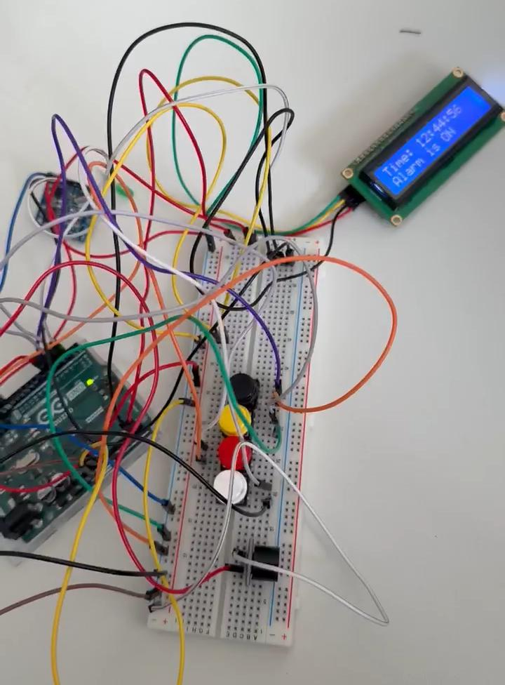

<em>Fig 9: Final alarm clock — LCD showing "Time: 12:44:56" and "Alarm is ON"</em>

**Observations:** The alarm clock worked as intended. The time was accurate, the alarm triggered at the correct time, and the buzzer could be dismissed with a button press without touching the code.

**What went wrong:** When everything was connected together the LCD showed random garbled characters. After checking all wires we found a loose connection on the I2C line. Re-seating it fixed the display straight away.

---

## Components Used

- Arduino Uno
- 16x2 I2C LCD — address `0x27`
- DS1307 RTC Module — address `0x68`
- Passive buzzer + 220 Ω resistor
- Push buttons x4
- Breadboard + jumper wires
- Libraries: `LiquidCrystal_I2C.h`, `RTClib.h`, `Button.h`
